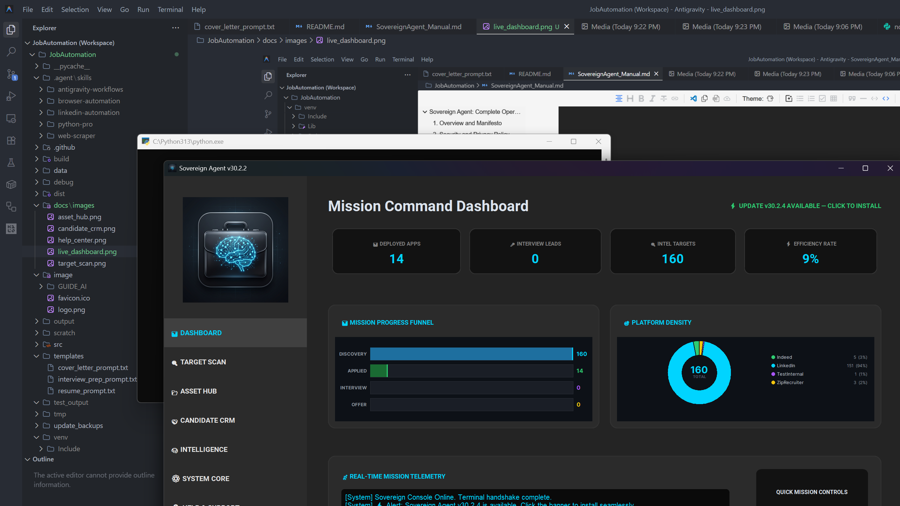
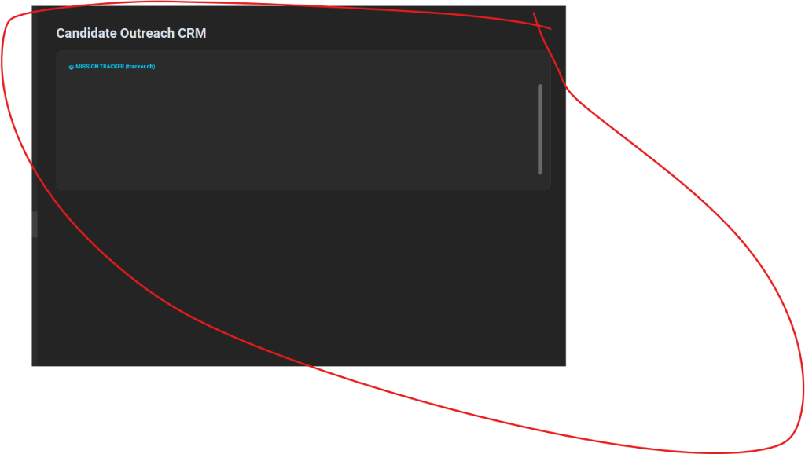
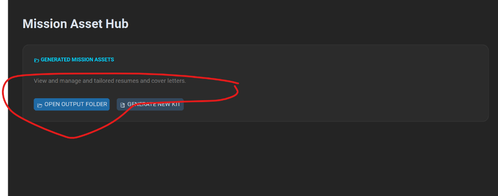
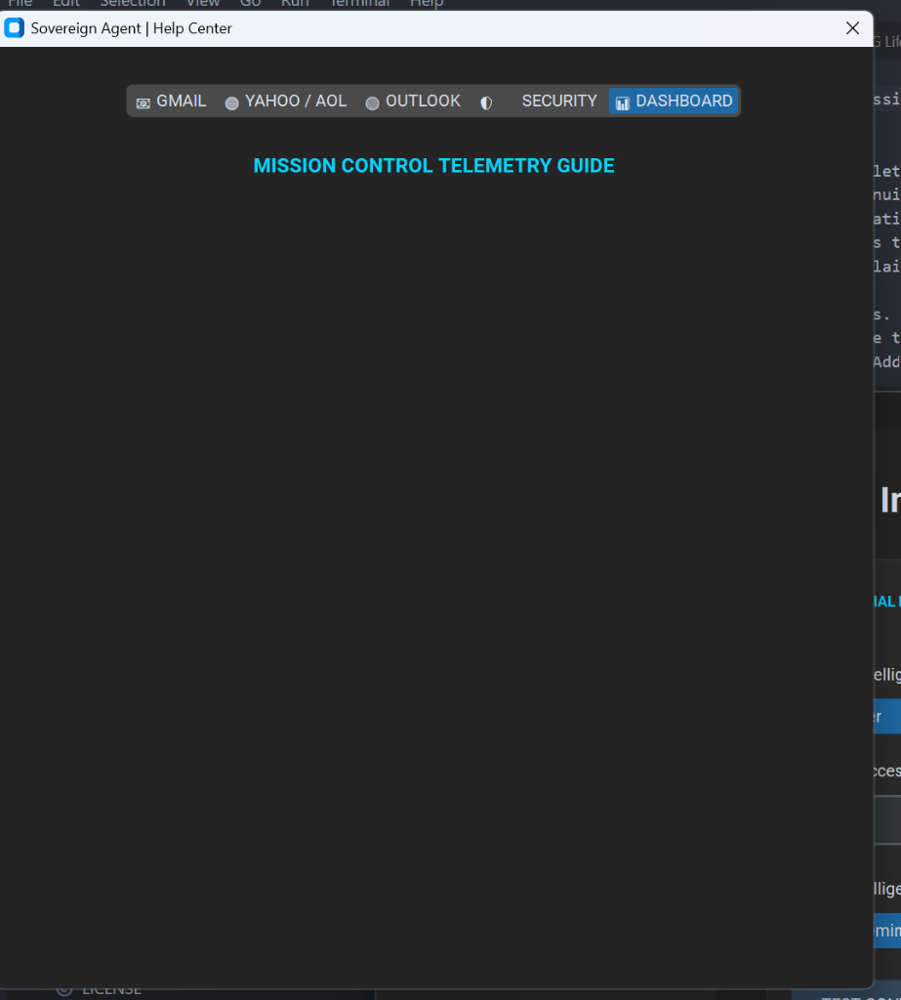

# Sovereign Agent: Complete Operations Manual (v30.2.2)

## 1. Overview and Manifesto
In the contemporary landscape of automated HR filters and "Ghost Jobs," the job seeker requires a technological advantage. Sovereign Agent serves as a highly intelligent, localized automation engine designed to handle the repetitive aspects of the job application process, allowing the user to focus on interview preparation and career strategy.



## 2. Security and Privacy Policy
Privacy is a fundamental component of the Sovereign Agent architecture.
 * **Localized Storage**: All resumes, AI configurations, and authentication credentials are stored exclusively on the user's local machine.
 * **No Telemetry**: The system does not collect data or communicate with external servers beyond the specified AI providers and job platforms.
 * **Auditability**: As an open-source project, the codebase is fully transparent and available for security auditing.

## 3. System Requirements and Installation

### Windows Installation
Windows users may choose between a portable executable or running from the source code.

#### Option A: Portable Executable (Recommended)
1. Download the latest `SovereignAgent_Portable.zip` from the official repository releases.
2. Extract the contents to a dedicated directory (e.g., `C:\SovereignAgent`).
3. Execute `SovereignAgent_Portable.exe` to launch the application.

#### Option B: Installation from Source
1. Install Git from git-scm.com.
2. Install Python 3.10+ from Python.org, ensuring the "Add Python to PATH" option is selected.
3. Open a terminal and execute the following commands:
   ```powershell
   git clone https://github.com/wisdomgreat/JobAutomation.git
   cd JobAutomation
   pip install -r requirements.txt
   python main.py
   ```

### macOS Installation
macOS requires execution from the source code via the Terminal.
1. Install Homebrew:
   ```bash
   /bin/bash -c "$(curl -fsSL https://raw.githubusercontent.com/Homebrew/install/HEAD/install.sh)"
   ```
2. Install Python:
   ```bash
   brew install python
   ```
3. Clone and Run:
   ```bash
   git clone https://github.com/wisdomgreat/JobAutomation.git
   cd JobAutomation
   pip3 install -r requirements.txt
   python3 main.py
   ```

### Linux and Unix Installation
1. Install system dependencies:
   ```bash
   sudo apt update
   sudo apt install python3 python3-pip git python3-tk
   ```
2. Clone and Run:
   ```bash
   git clone https://github.com/wisdomgreat/JobAutomation.git
   cd JobAutomation
   pip3 install -r requirements.txt
   python3 main.py
   ```

## 4. Post-Installation Configuration

### Initial Launch and Mandatory Onboarding
Upon the first execution, the Sovereign Agent enters a locked state. The Dashboard and Scanning features will only activate once the "Mission Readiness" parameters (AI keys, Identity, and Resume) are satisfied.

### AI Engine Configuration
The system relies on a Large Language Model (LLM) to parse job descriptions and generate tailored content.

1. **Navigate to Intelligence**: Select the `🧠 INTELLIGENCE` tab in the sidebar navigation.
2. **Artificial Intelligence Core**:
   * **Primary Intelligence Engine:**: Select your provider (e.g., OpenAI or OpenRouter).
   * **Provider Access Token (Encrypted):**: Enter your API key (ensure no spaces).
   * **Target Intelligence Model:**: Select your preferred model (e.g., `gpt-4o-mini`).
3. **Validation**: Click `🧪 TEST CONNECTION`. A successful handshake will display a confirmation in the terminal telemetry.

### Identity Commander Setup
Setting your identity is critical for accurate tailoring and automated form-filling.

1. **Access Identity**: Navigate to the `⚙️ SYSTEM CORE` tab.
2. **Launch Editor**: Click `📝 LAUNCH IDENTITY COMMANDER`.
3. **Identity Tabs**: Provide your professional details across the following tabs:
   * **Personal**: Name, contact details, and social links (LinkedIn/GitHub).
   * **Work Auth**: Authorization status and visa requirements.
   * **Experience**: Years of experience and a high-level professional summary.
   * **Preferences**: Salary expectations, work mode (Remote/Hybrid), and relocation status.
   * **Skills**: Your full technical and soft skill stack.
4. **Finalize**: Click `💾 SAVE & SYNC MASTER IDENTITY` to commit the data.

### Asset Hub and Master Resume
The AI uses your "Master Resume" as the source of truth for all career data.

1. **Navigate to `📂 ASSET HUB`**.
2. **Upload Primary Resume**: Select your current resume (PDF or DOCX).
3. **Mission Ingestion**: The system will confirm successful ingestion. This document is archived locally and used to generate tailored variants for every application.

### Behavioral Stealth Configuration
To protect your accounts on LinkedIn and Indeed, the agent includes human-mimicry protocols.

1. **Access Controls**: Navigate to the `🔍 TARGET SCAN` tab.
2. **Tactical Controls**:
   * **Match Intensity**: Set the minimum score (e.g., 70%) for automated consideration.
   * **Search Intensity**: Set the maximum jobs discovered per platform session.
   * **BEHAVIORAL STEALTH (Human Mimicry)**: Ensure this toggle is **ENABLED** to implement randomized pauses and human scroll patterns.

## 5. Operational Procedures

### Automated Job Scanning
1. **Navigate to `🔍 TARGET SCAN`**.
2. **Global Search Matrix**: Click `🧭 LAUNCH SEARCH MATRIX`.
3. **Job Discovery Matrix**:
   * Enter your **Search Keywords** and **Location**.
   * Toggle the desired platforms (LinkedIn, Indeed, etc.).
   * Click `⚡ INITIATE TACTICAL SCAN`.
4. **Monitoring**: View the results appear in the `🤝 CANDIDATE CRM`.

### Candidate CRM Management
1. **Review Feed**: Navigate to the `🤝 CANDIDATE CRM` tab.
2. **Analyze Targets**: Review the AI-calculated Match Score (0-100%).
3. **Actions**:
   * `APPLY`: Generates a tailored resume and cover letter instantly.
   * `💬 LOG`: Opens the Strategic Outreach Terminal to log recruiter contacts.
   * `✅`: Marks the job as applied and archives it.
   * `🗑️`: Dismisses the opportunity.



### Targeted Surgical Strike
For specific job opportunities found outside the automated scan:

1. **Navigate to `🔍 TARGET SCAN`**.
2. **Surgical URL Strike**: Paste the direct job URL into the entry field.
3. **Select Platform**: Choose the source platform (or Auto-Detect).
4. **Initiate**: Click `🚀 EXECUTE STRIKE`.



## 6. Advanced Configuration: Email Integration
The Email Scanner parses incoming job alerts from Gmail, Yahoo, or Outlook.

1. **Navigate to `🧠 INTELLIGENCE`**.
2. **Email Discovery**: Review the configuration and click `❔ SETUP GUIDE` for provider-specific "App Password" instructions.
3. **Initiate Scan**: Navigate to `🔍 TARGET SCAN` and click `🔍 INITIATE EMAIL SCAN`.



## 7. Frequently Asked Questions (FAQ)

### Is using this bot safe for my LinkedIn account?
Yes. The Sovereign Agent is designed with behavioral offsets. It avoids rapid-fire actions, implements human scrolling patterns, and does not interact with protected API endpoints directly. However, it is always recommended to use the "Stealth Mode" settings for maximum safety.

### Why is the Candidate CRM feed empty?
The CRM feed defaults to showing "NEW" jobs. If you have already applied to or dismissed all targets, the feed will appear empty. Ensure your search parameters (Title/Location) are broad enough to yield results.

### Which AI model provides the best value?
**gpt-4o-mini** via OpenRouter is currently the most cost-effective solution, providing high-quality tailoring for cent-fractions per application.

### Does the system support remote-only searches?
Yes. Simply input "Remote" or "Work from Home" into the Location field of the Search Matrix.

## 8. Troubleshooting Guide

### Application Crash on Launch (Windows)
If the application crashes immediately with a `TclError`, ensure you are using the latest version (v30.2.2+). This is a known compatibility issue with Windows 11 title bar rendering which has been patched in recent updates.

### "No Update Available" Error
If the update banner does not appear automatically, navigate to `⚙️ SYSTEM CORE` and click `🔄 SYNC SYSTEM CODE` to force a check against GitHub HQ.

### Search Engine Failing to Extract Jobs
1. Verify your internet connection.
2. Ensure you do not have a VPN active that is blocked by job platforms.
3. Check the `📡 REAL-TIME MISSION TELEMETRY` log on the Dashboard for specific platform errors.

### API Key Rejected
Ensure there are no leading or trailing spaces in your API key. Test the key using the `🧪 TEST CONNECTION` button in the Intelligence tab.

### Documentation and Support
For persistent issues, utilize the repository's issues tracker or navigate to `❓ HELP & SUPPORT` in the app for official project links.
